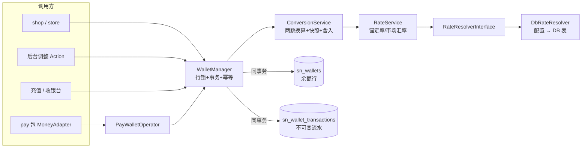
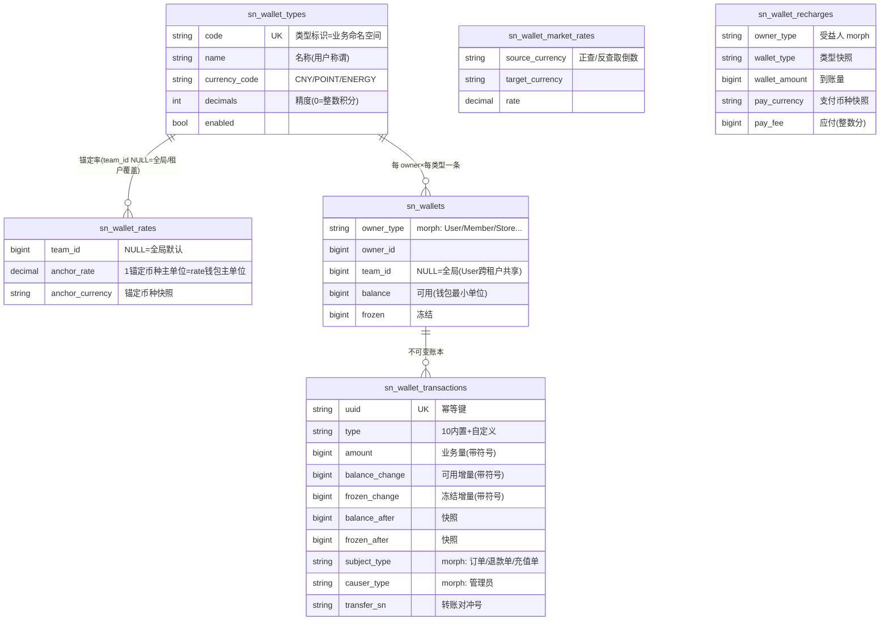
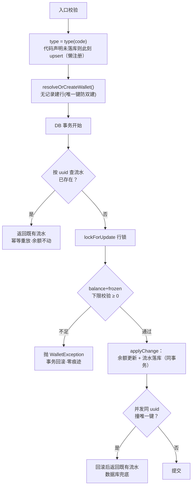
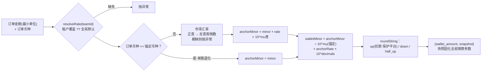
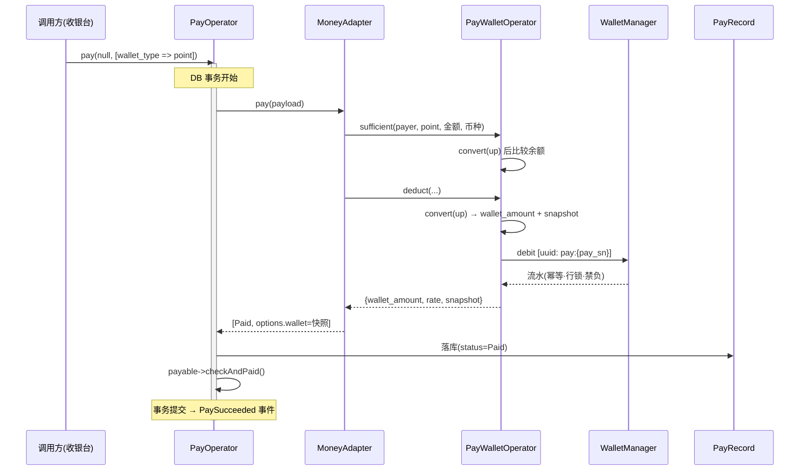
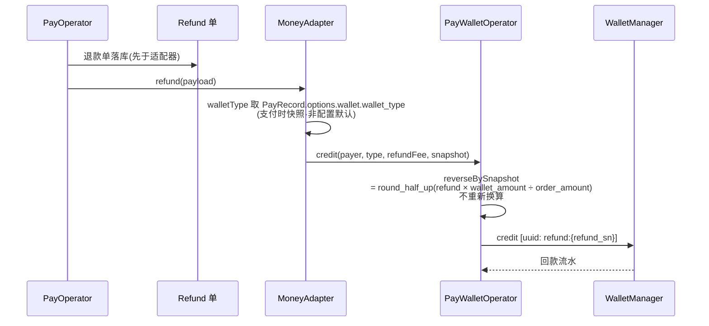
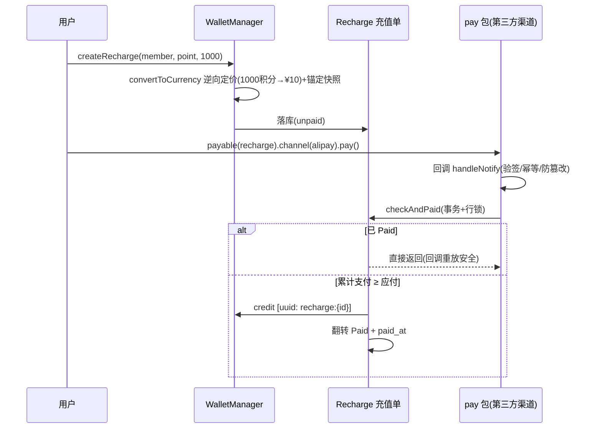
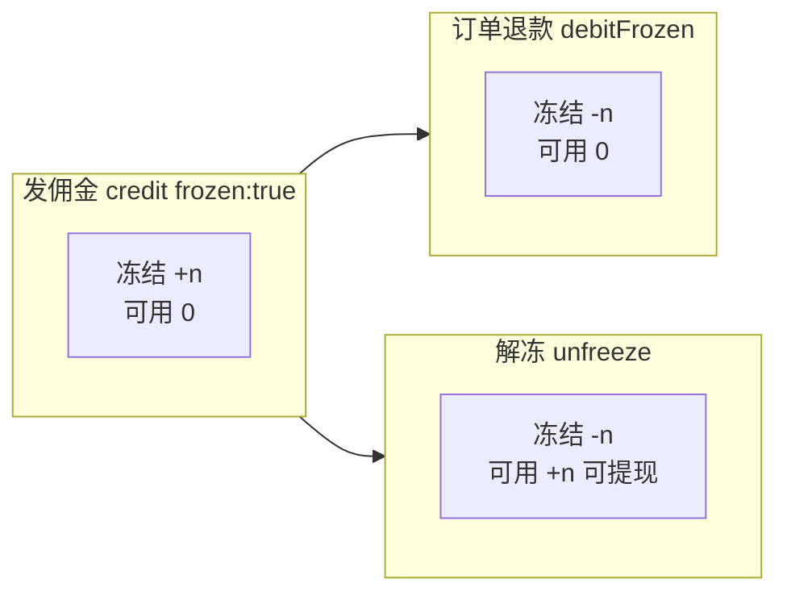

# Wallet 架构文档

> 多类型虚拟钱包扩展包（余额 / 积分 / 能量值）：不可变账本、冻结体系、两跳换算、pay 余额通道集成。
> 配套使用文档见 [README](../README.md)；面向开发者的账本铁律见主仓库 `.ai/rules/wallet-src.md`。

## 1. 设计原则（四条铁律 + 一条归属规则）

| 铁律 | 含义 |
|---|---|
| **流水即真相** | `sn_wallet_transactions` 不可变（禁止 update/delete，冲正走反向流水）；余额只是流水的快照缓存，可用 `sn-wallet:reconcile` 随时重放校验 |
| **幂等记账** | 每条流水一个 uuid（唯一键）：同一业务事件（pay_sn / refund_sn / recharge id / transfer sn）无论重放多少次只记一次账 |
| **禁止负数** | 行级锁 + 余额下限校验同事务，可用与冻结均 ≥ 0（佣金变负问题由冻结体系根治） |
| **快照退款** | 换算快照随扣款固化（流水 options + PayRecord.options.wallet 双份）；退款按快照等比例回退，绝不重新换算 |
| **team_id NULL = 全局** | 遵循项目规范：NULL=全局钱包（User 跨租户共享），Member/Store 等自带 team_id 属性的 owner 挂租户；流水行 team_id 记租户归因 |

## 2. 包结构

```
addons/wallet/
├── config/sn-wallet.php                  # 本位币 / 静态市场汇率兜底 / 类型声明 / 可替换模型 / 面板注册
├── database/migrations/                  # 6 张表 stub（主仓库 database/migrations 有日期执行版）
│
└── src/
    ├── WalletServiceProvider.php         # ①登记 ModuleRegistry ②绑定 sn-wallet 单例
    │                                     # ③绑定 RateResolverInterface ④绑定 pay 的 WalletOperator
    ├── WalletPlugin.php                  # Filament 插件：注册 4 组管理资源
    ├── WalletManager.php        ★核心    # 所有余额变动的【唯一入口】
    ├── Facades/Wallet.php               # Wallet::credit(...) → app('sn-wallet')
    │
    ├── Models/
    │   ├── WalletType.php               # 类型（code/decimals/币种代码）+ resolveRate()
    │   ├── WalletRate.php               # 锚定率行（NULL=全局默认 / 租户覆盖行）
    │   ├── Wallet.php                   # 钱包（owner 多态 + balance + frozen）
    │   ├── WalletTransaction.php        # 不可变流水（容错 cast：枚举或自定义类型）
    │   ├── MarketRate.php               # 市场汇率
    │   ├── Recharge.php                 # 充值单（实现 pay 包 PayableInterface）
    │   └── Concerns/HasWallets.php      # owner 侧可选 trait
    │
    ├── Services/
    │   ├── ConversionService.php ★换算  # 两跳换算 + 快照 + 舍入（bcmath 全程字符串）
    │   ├── RateService.php              # 锚定率解析 + 市场汇率（正查→反查取倒数）
    │   ├── PayWalletOperator.php        # 实现 pay 的 WalletOperator（money 通道扣/退款）
    │   └── RateResolvers/DbRateResolver # 市场汇率源：配置优先→DB 表（可换外部 API）
    │
    ├── Casts/TransactionTypeCast.php    # 流水类型容错 cast（自定义类型保持字符串）
    ├── Support/TransactionTypes.php     # 流水类型注册表（内置枚举 + 调用方注册）
    ├── Enums/                           # TransactionType（10 种）/ RechargeStatus
    ├── Commands/                        # sn-wallet:install / sn-wallet:reconcile（对账）
    └── Filament/Resources/              # 4 组管理资源
```

## 3. 分层调用



## 4. 数据模型（ER）



**两个标识字段的分工**（易混淆，重点）：

| 字段 | 唯一性 | 解决的问题 |
|---|---|---|
| `uuid` | **唯一索引** | 行级身份 + 幂等：「同一业务事件只记一次账」；命名即语义：`pay:{pay_sn}` / `refund:{refund_sn}` / `recharge:{id}` / `transfer-out:{sn}` / `transfer-in:{sn}` |
| `transfer_sn` | 普通索引（共享） | 事件级关联：「这两条流水是同一笔转账」——转账的双腿各需自己的 uuid（唯一索引不允许共用），配对只能靠不唯一的共享号（≈复式记账的分录号） |

## 5. 核心流程

### 5.1 原子变动（credit / debit / freeze / unfreeze / debitFrozen 共用）



### 5.2 两跳换算（ConversionService::convert）



示例：`$10 ──市场率 7.2──> ¥72 ──锚定率 100:1──> 7200 积分`

**本位币变更安全**：锚定币种随率行自带快照，市场汇率轴心切换后存量锚定自动多一跳换算，余额与在途支付单（已固化快照）不受影响。

### 5.3 余额支付端到端（pay money 通道）



### 5.4 退款按快照回退



### 5.5 在线充值闭环



### 5.6 佣金冻结生命周期（负数佣金问题的解法）



不变式：任意时点 冻结 ≥ 0 且 可用 ≥ 0 —— **佣金永远不可能变负**；窗口期内提现被拒（可用 0）由原子变动的下限校验天然保证，业务层无需判断。

## 6. 设计决策速查

| 问题 | 决策 | 理由 |
|---|---|---|
| 多包独立余额（shop/cms/store） | 类型 code 即命名空间：`shop_balance` / `cms_balance` | 同一 owner 天然得到多个独立钱包行，无需归属机制 |
| 门店独立钱包 | owner morph 支持任意模型：门店钱包 owner=Store；用户×门店储值 owner=StoreMember | 钱包包零改动，建模归 store 模块 |
| 租户汇率 | 类型全局一套，费率行支持租户覆盖（`resolveRate(teamId)`） | 全局 User 钱包价值一致性 vs 租户运营灵活性的折中 |
| owner 列不用 morphs() | 显式列 + 复合唯一 `(owner_type, owner_id, wallet_type_id)` | morphs 自带索引与唯一键最左前缀重复；显式收窄索引长度 |
| 流水类型扩展 | 内置枚举 + `registerTransactionTypes()` 注册表 + 容错 cast | 区分业务来源用 subject morph + options；需要独立筛选/统计口径才注册自定义类型 |
| 异常提示 | 用户可见异常（余额不足等）抛出点经 `__()` 翻译并含类型名，调用方 catch 后直接 `getMessage()` 给前端；系统/配置类错误保持英文 | 简单直接，同步请求流 locale 正确；日志可检索性由系统类错误英文兜底 |
| get_sn 掩码 | `get_sn($from->getKey(), 'T')`（发起人 id） | 把单号碰撞收敛到「同一用户同秒并发随机数重叠」；uuid 唯一键兜底不记错账 |
| 记账本位币 | `sn-wallet.base_currency` null = 站点默认货币，仅展示≠记账时覆盖 | 财务轴心与展示默认解耦，默认对齐 |
| panel_register 翻译 | 必须写纯字符串键（自动惰性），禁止 `fn () => __()` 闭包 | 闭包在面板注册期立即求值；新包 boot 晚于 Filament 时整组翻译被缓存为空 |
